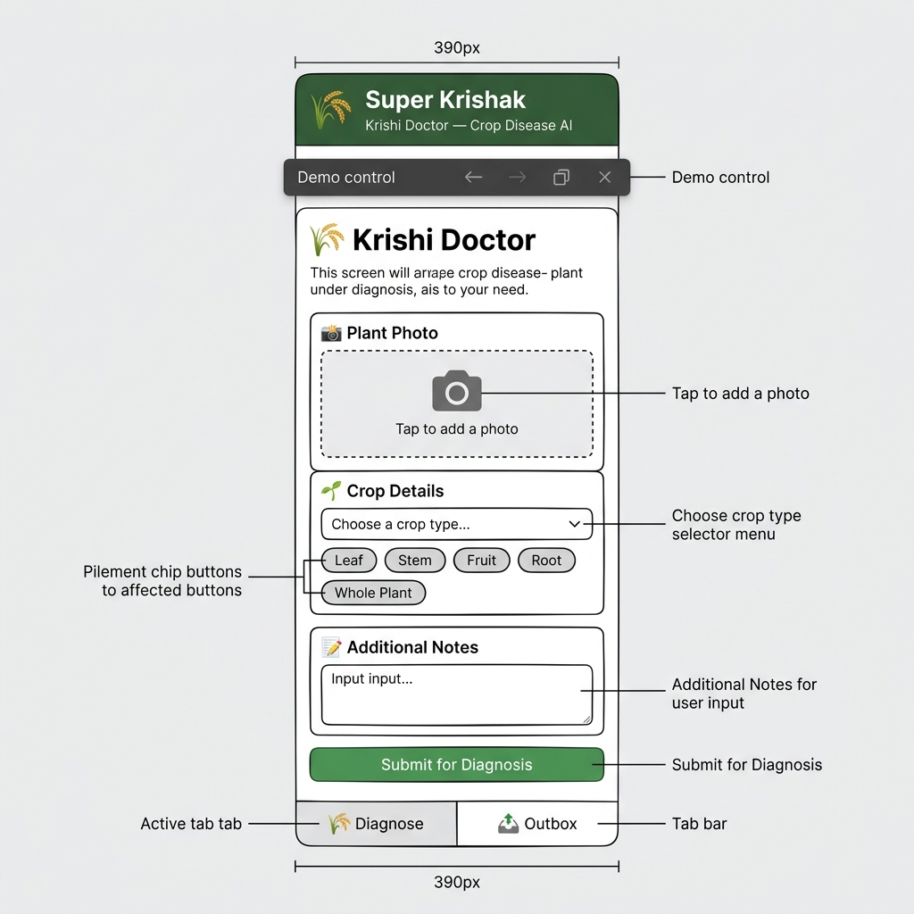
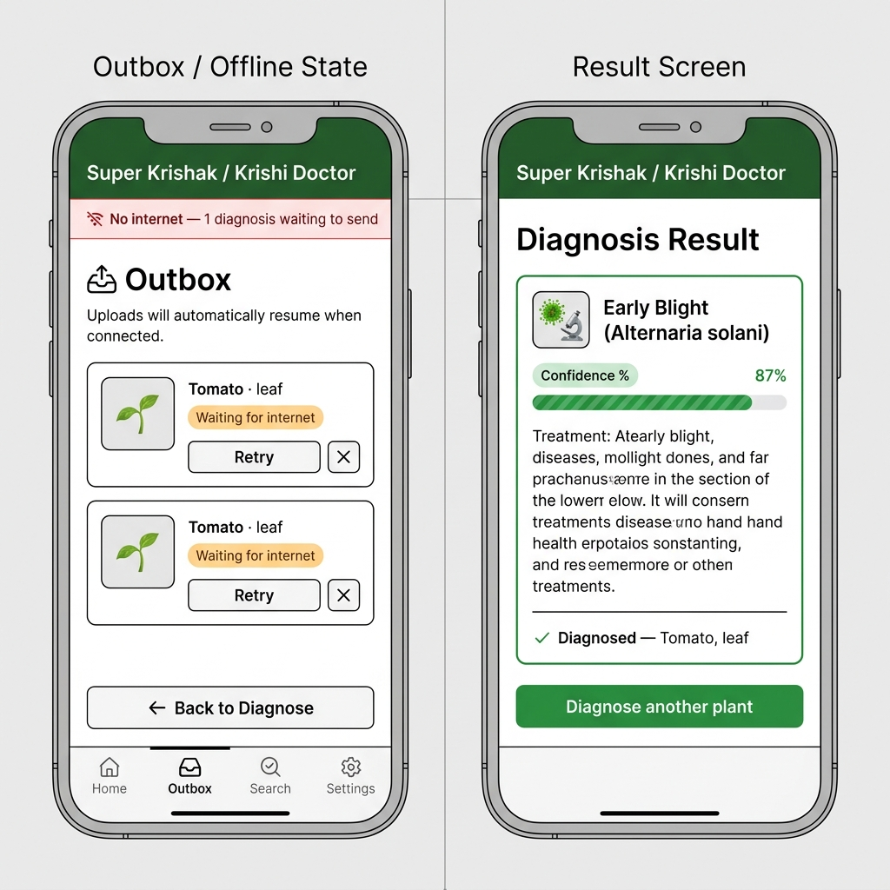

# Super Krishak — Product Analysis & Prototype Challenge

**Live demo:** https://test-anil-tau.vercel.app
**Author:** Anil · Branch: `feature/ui-prototype-anil`

---

## 🚀 Run Locally

```bash
git clone https://github.com/nirmal628/Test_Anil.git
cd Test_Anil
git checkout feature/ui-prototype-anil
npm install
npm run dev   # → http://localhost:5173
```

**Key demo flow:**
1. Fill in the form (photo → crop → affected part)
2. Click **Submit for Diagnosis**
3. While "Uploading…", **untick Online** in the demo bar → job lands in Outbox as QUEUED
4. **Tick Online** again → auto-retries and shows diagnosis result
5. Switch API dropdown to `500 error` to test the FAILED + retry path

---

## Part 1: QA & Logical Edge-Case Audit

### Bug #1 — Weather Widget Loses All State When Offline *(State-Handling Bug)*

| | |
|---|---|
| **Feature / Screen** | Home screen — Weather & Location card |
| **Steps to Reproduce** | 1. Log in with internet ON (shows "Lalitpur, 21.9 °C"). 2. Turn off WiFi/mobile data. 3. Close and reopen the app (still offline). |
| **Expected** | Last-known weather ("Lalitpur, 21.9 °C") displays from local cache with a "last updated" timestamp. |
| **Actual** | Temperature shows `---` and the card reverts to "Add Location" — as if no location was ever set. |
| **Root Cause** | The weather card renders purely from the live API response with no local persistence layer. On launch the app skips the stored location ID when the weather fetch fails, so the UI falls back to its "no location" default. Location data is stored (returns when online), but UI state is coupled to network success rather than cached data. |
| **Evidence** | `screenshots/offline-home.jpeg` |

### Bug #2 — Offline Login Shows Generic "Network Error" — No Pre-Check, No Queue *(Workflow Bug)*

| | |
|---|---|
| **Feature / Screen** | "Let's Connect" (Login) screen |
| **Steps to Reproduce** | 1. Open app to login screen. 2. Turn off internet. 3. Enter valid mobile number and tap "Let's Connect." |
| **Expected** | App detects no connectivity before the API call and shows "No internet connection — we'll send your OTP automatically when you're back online." Entered data is preserved and auto-retried on reconnect. |
| **Actual** | Generic toast "Network Error" appears. Entered number is discarded; nothing is queued or retried. |
| **Root Cause** | Submit handler fires the API request unconditionally with no connectivity pre-check. The catch block maps all failures to one generic string (no error-code differentiation). No local retry queue or form-state persistence exists. Spans: missing pre-flight network check, catch-all error handling, and no offline queue architecture. |
| **Evidence** | `screenshots/login-network-error.jpeg` |

### Bug #3 — Error Banners Render Behind the System Status Bar *(UI / Layout Bug)*

| | |
|---|---|
| **Feature / Screen** | Global — all toast/banner notifications (Home & Login) |
| **Steps to Reproduce** | 1. Trigger any toast (go offline and reopen app, or attempt offline login). 2. Observe top of the screen. |
| **Expected** | Toast/banner displays fully below the status bar, readable. |
| **Actual** | Banner is drawn behind/under the status bar — text overlaps the clock and battery icons and is partially illegible. |
| **Root Cause** | Banner container uses fixed top positioning without accounting for system status bar height / safe-area insets (`WindowInsets`). Worsens on devices with tall status bars or gesture navigation. Frontend-only layout bug — needs `padding-top: env(safe-area-inset-top)` or `WindowInsetsCompat`. |
| **Evidence** | `screenshots/status-bar-overlap.jpeg` |

---

## Part 2: Feature Logic Spec — Crop Disease Diagnosis Submission

Full spec in **[FEATURE_SPEC.md](./FEATURE_SPEC.md)**. Summary:

### State Machine
```
IDLE → VALIDATING → COMPRESSING → UPLOADING → ANALYZING → SUCCESS
                                       ↘ QUEUED (offline) → RETRYING
                                       ↘ FAILED (4xx/5xx) → retry queue
```

### Offline Handling
- On connectivity loss mid-upload: job immediately persisted to `localStorage` with full `DiagnosisJob` payload
- Job survives app close — nothing lives in memory only
- On reconnect: background worker picks up due jobs, retries with **exponential backoff** (30s → 2m → 10m → 30m → 1h, max 5 attempts)
- Submit is **idempotent** via `jobId` UUID — retries never double-count

### Validation Rules

| Field | Rule | Error Message |
|---|---|---|
| Photo | Required; JPEG/PNG/WebP; max 10 MB | "Please add a photo of the affected plant part" |
| Crop type | Required; from server crop list | "Please select the crop" |
| Affected part | Required enum (leaf/stem/fruit/root/whole) | "Please select which part is affected" |
| Note | Optional; ≤ 500 chars | "Note must be under 500 characters" |

### Error Messages

| Status | Farmer Sees |
|---|---|
| **400** | "Something in the details isn't right. Please check the photo and crop, then try again." |
| **401** | "Your session has expired. Please log in again — your diagnosis will be saved and sent after you log in." |
| **500** | "Our server hit a problem. Your diagnosis is saved and will send automatically when the service recovers." |
| **Offline** | "No internet connection. This diagnosis is saved in Outbox and will send automatically when you're back online." |

---

## Part 3: Wireframes & Prototype

### Wireframes (Low-Fi, 3 Screens)

**Screen 1 — Diagnose Form (default + loading state)**


**Screen 2 & 3 — Outbox/Offline State + Result Screen**


### TypeScript Prototype

| File | Purpose |
|---|---|
| `src/types.ts` | TypeScript types: `DiagnosisJob`, `SubmissionState`, `DiagnosisResult`, `ApiMode` |
| `src/mockApi.ts` | Mock API — success / 500 error / timeout modes, realistic latency |
| `src/outbox.ts` | localStorage outbox with exponential backoff, idempotent upsert |
| `src/App.tsx` | Full submission state machine, background retry worker |
| `src/screens/DiagnoseForm.tsx` | Validated form with photo picker, crop chips, loading spinner |
| `src/screens/OutboxScreen.tsx` | Status badges, retry/delete actions, pending count |
| `src/screens/ResultScreen.tsx` | Animated confidence bar, treatment, severity label |

**What's implemented:**
- ✅ Full TypeScript data models for all states
- ✅ Controlled form with field-level validation
- ✅ Loading state (spinner + disabled submit)
- ✅ Mock API with success / 500 / timeout modes (switchable via demo bar)
- ✅ Offline detection — job queued to localStorage automatically
- ✅ Exponential backoff retry queue (30s → 2m → 10m → 30m → 1h)
- ✅ Background worker — auto-retries due jobs every 3s when back online
- ✅ Success screen with animated confidence bar
- ✅ Idempotent submit (UUID `jobId` prevents double-counting on retry)
- ✅ Premium UI — dark green agri theme, smooth animations, card sections

---

## Part 4: Git Workflow

**Branch:** `feature/ui-prototype-anil`
**PR:** https://github.com/nirmal628/Test_Anil/pulls

Commits follow conventional commit format — never pushed directly to `main`.

**Live:** https://test-anil-tau.vercel.app
